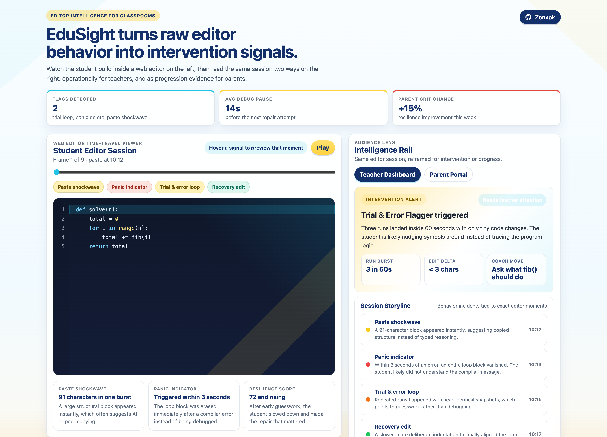

# EduSight

**Editor intelligence for classrooms.** EduSight turns raw editor behavior into intervention signals — so a teacher sees who is stuck _right now_, and a parent sees how their child grew this session.

<p>
  
  
  
</p>

### Every incident is a moment you can inspect

Hover any entry in the **Session Storyline** and the editor time-travels to that exact keystroke — the matching line lights up, the playhead jumps, and the signal chip highlights. The narrative and the evidence stay linked.


<!---->

---

## The problem

Kids can produce correct-looking code without understanding it — pasting from an AI chat, guessing blindly after an error, or spamming _Run_ until a green checkmark appears. A finished file hides all of that. The _keystrokes_ don't.

EduSight replays a coding session from lightweight telemetry and reads the same evidence two ways: **operationally for teachers**, and as **progression evidence for parents**.

## Two lenses, one session

Watch the student build inside the time-travel editor on the left, then flip the audience lens on the right.

| Teacher Dashboard                                                                                                                                   | Parent Portal                                                                                                       |
| --------------------------------------------------------------------------------------------------------------------------------------------------- | ------------------------------------------------------------------------------------------------------------------- |
| Flags micro-anomalies as they happen: _"Trial & Error Flagger triggered — three runs in 60 seconds with tiny changes. Ask what `fib()` should do."_ | Reframes the identical session in growth language: _"Your child stayed with the problem longer than last session."_ |

## The behavioral signals

The diagnostic engine ([`js/engine.js`](js/engine.js)) is pure, DOM-free, and reads a session's event stream against three indicators:

| Signal                      | What it catches                                       | Detected when                                                          |
| --------------------------- | ----------------------------------------------------- | ---------------------------------------------------------------------- |
| **Paste Shockwave**         | Copying from AI or a peer instead of typing reasoning | An insert/paste of **> 40 chars** lands in **< 10 ms**                 |
| **Backspace Cascade**       | Panicking after an error instead of debugging it      | A block is wiped within **3 s** of a failed execution                  |
| **Infinite Execution Loop** | Nudging symbols and re-running, hoping it passes      | **3 runs inside 60 s** with a code diff of **< 3 chars** (Levenshtein) |

The same stream also earns the positives parents want to see — a **Resilient Debugger** badge for reading an error and fixing it, an **Architectural Thinker** badge for steady, intentional composition.

## Architecture

Static single-page app — no framework, no bundler.

- **`index.html`** — the split-screen viewer, editor replay, and audience-lens UI.
- **`js/engine.js`** — the diagnostic functions and score computation (imported by both the browser and the tests).
- **`js/teacher.js` / `js/parent.js`** — the two audience views.
- **`data/sessions/*.json`** — recorded telemetry sessions the demo replays.

Telemetry is captured on logical delimiters (space, enter, semicolon, cursor move) rather than every keystroke — designed with network and filesystem bounds in mind.

## Getting started

```bash
git clone https://github.com/Zonxpk/edusight
cd edusight

npm run serve   # python3 -m http.server 8000
# open http://localhost:8000
```

Run the engine tests:

```bash
npm test        # node js/engine.test.js
```

## Project structure

```
edusight/
├─ index.html            # single-page app
├─ css/                  # brand + base styles
├─ js/
│  ├─ engine.js          # diagnostic functions (pure)
│  ├─ engine.test.js     # assertion-based tests
│  ├─ teacher.js         # teacher dashboard view
│  └─ parent.js          # parent portal view
├─ data/sessions/        # sample telemetry sessions
└─ docs/                 # specs, plans, screenshots
```
